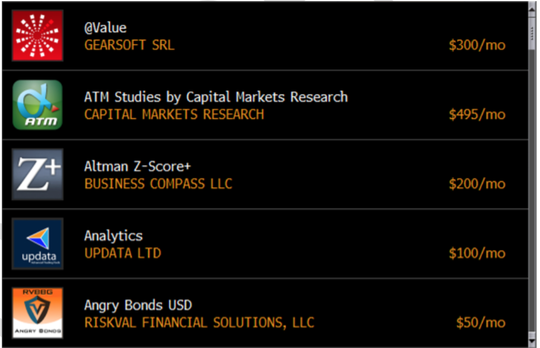

#BLOOMBERG UX – HTML5 UI/UX DEVELOPER

###Purpose of this exercise
We are interested in your ability to quickly turn a design specification for a business application into a functional prototype and then discuss the prototype with us in a critiquing session. This exercise will allow us to gauge if your conceptual skills, technical proficiency, and communication style are a good fit for Bloomberg’s Financial Products UX Team.

###Deliverables
You must build an interactive prototype that meets the design specifications outlined in the “Prototype Requirements” section. Your solution must only use HTML5 (HTML, CSS3, JavaScript), and it must work correctly in the latest version of the Google Chrome web browser (Dev and Canary builds are acceptable).

###Context
The Bloomberg Application Portal is a platform for distributing third-party financial software via the BLOOMBERG PROFESSIONAL® service. Within the portal, Bloomberg clients can browse different categories of financial applications, view descriptions and reviews of them, and purchase, download, and install them within their Bloomberg Terminal. The current UI technology only allows a simple list view of the applications in the portal (see Figure 1 below). This exercise will implement a new design of providing different views of the applications within the portal.

