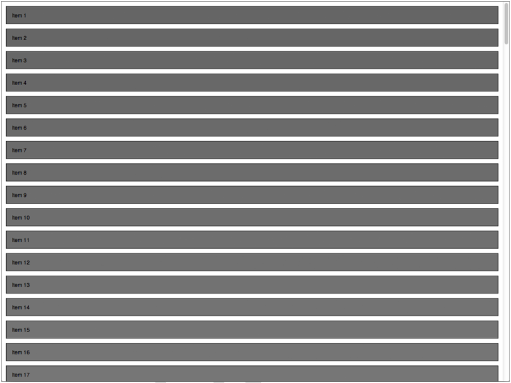
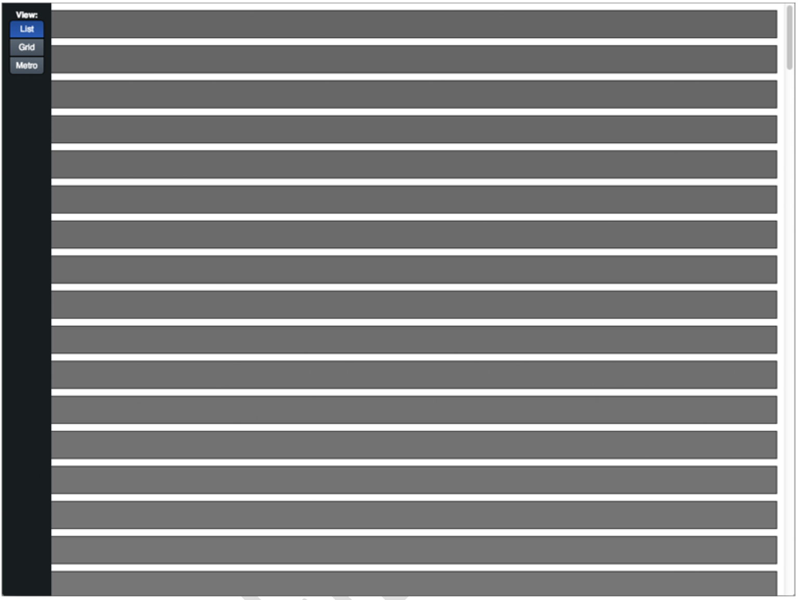
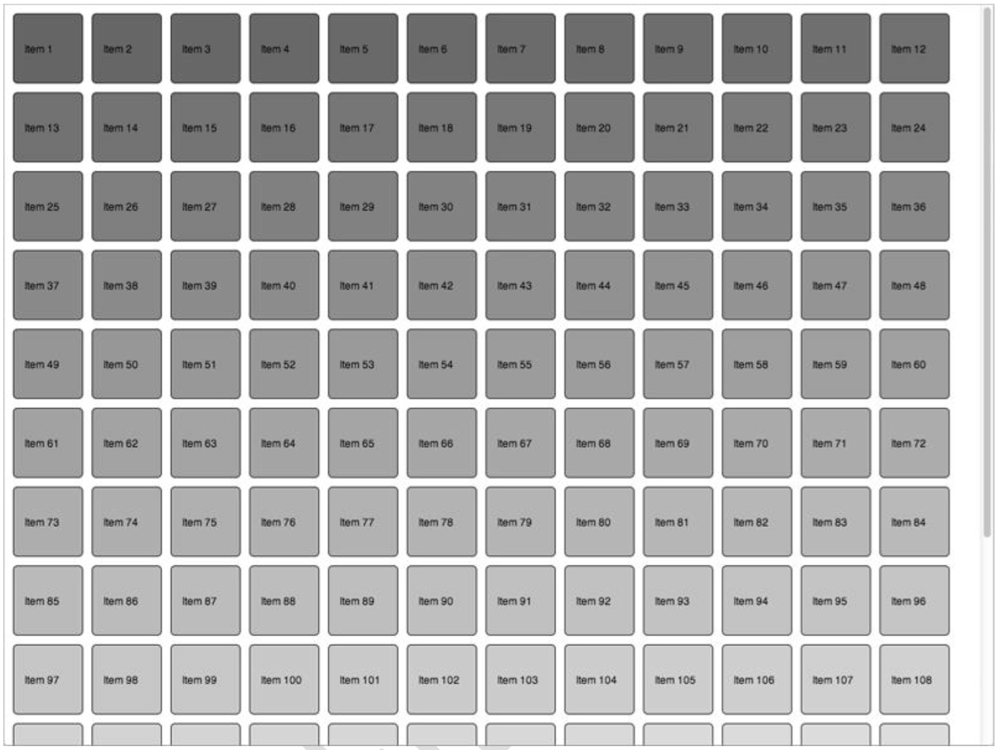

#BLOOMBERG UX – HTML5 UI/UX DEVELOPER

###Purpose of this exercise
We are interested in your ability to quickly turn a design specification for a business application into a functional prototype and then discuss the prototype with us in a critiquing session. This exercise will allow us to gauge if your conceptual skills, technical proficiency, and communication style are a good fit for Bloomberg’s Financial Products UX Team.

###Deliverables
You must build an interactive prototype that meets the design specifications outlined in the “Prototype Requirements” section. Your solution must only use HTML5 (HTML, CSS3, JavaScript), and it must work correctly in the latest version of the Google Chrome web browser (Dev and Canary builds are acceptable).

###Context
The Bloomberg Application Portal is a platform for distributing third-party financial software via the BLOOMBERG PROFESSIONAL® service. Within the portal, Bloomberg clients can browse different categories of financial applications, view descriptions and reviews of them, and purchase, download, and install them within their Bloomberg Terminal. The current UI technology only allows a simple list view of the applications in the portal (see Figure 1 below). This exercise will implement a new design of providing different views of the applications within the portal.

Figure 1 – The list view of applications in the Bloomberg Application Portal

#Prototype Requirements

###SECTION A
1. The prototype must render 150 individual items as well as a left sidebar that contains a label (View) and three buttons (List, Grid, Metro) that have normal, hover, and selected states. See Figures 2 and 3 for examples of the UI in its “wake-up state” as well as all elements on the screen at once.
2. The display of items must be configurable in three orientations:
a. List – items are rectangles that extend the width of the window and are arranged top-to-
bottom with vertical overflow. This must be the default view. See Figure 2 for an example of
the List view.
b. Grid – items are squares arranged left-to-right, wrapping top-to-bottom with vertical overflow.
See Figure 4 for an example of the Grid view.
c. Metro – items are squares arranged top-to-bottom, wrapping left-to-right with horizontal
overflow. See Figure 5 for an example of the Metro view.
3. The sidebar must be capable of being in two states – hidden and visible – and must be hidden by
default. When the sidebar is visible, it must appear on top of the items with a higher z-order.

###SECTION B
4. The sidebar must be made visible by either of the following interactions:
a. The user presses the Alt key
b. The user moves the mouse to the left edge of the window and leaves the mouse there for one (1) second
5. If the sidebar was made visible by pressing the Alt key, it must abide by the following interactions:
a. Pressing the L key must change to the List view, and the sidebar must change its state to
hidden.
b. Pressing the G key must change to the Grid view, and the sidebar must change its state to
hidden.
c. Pressing the M key must change to the Metro view, and the sidebar must change its state to
hidden.
d. Pressing the Alt key must hide the sidebar.
e. Mousing over and out of the sidebar must have no effect on the state of the sidebar.
6. If the sidebar was shown by mousing over the left edge of the browser window, it must abide by the following interactions:
a. Mousing out of the sidebar must hide the sidebar.
b. Pressing the Alt key must have no effect on the state of the sidebar.
7. When the sidebar is visible (opened via the Alt key or a mouse-over), clicking on any of the View
buttons mentioned in Requirement 1 must change the orientation of the items to the corresponding
state, and the sidebar must remain visible.
8. When the sidebar is hidden, the Alt key can be used as a modifier. Pressing the L, G, or M key while the
Alt key is held down (i.e., Alt+L, Alt+G, Alt+M) must change the orientation of the items accordingly, and the sidebar must never become visible.

###SECTION C
9. When the sidebar changes its state between hidden and visible, it must animate into the correct position. The animation must take a quarter-second (0.25 second) and must follow an ease-in/ease- out timing function.
10. When the view changes states, the items must animate into their correct position and size. The animation must take a half-second (0.5 second) and must follow an ease-in/ease-out timing function.

Figure 2 – Mockup of the prototype’s wake-up state

Figure 3 – Mockup of the prototype with all UI elements visible, in List view

Figure 4 – Mockup of the prototype in Grid view
