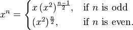

#Exponentiation By Squaring

Exponentiating by squaring is a method for fast computation of positive integer powers of a number. In comparing the [simple exponentiation](exp.rb) , the [recursive](exp_recursive.rb) and [while loop](exp_whileloop.rb) versions of exponentiation by squaring I received the following computation times for exp(2, 99999):

| Exponentiation Method        | Time (seconds)     |
|------------------------------|--------------------|
| Simple                       | 0.376556           |
| Recursive                    | 0.000090           |
| While loop                   | 0.000050           |

The while loop version is nearly 2 times faster than the recursive version and nearly 8000 times faster than the simple version.

It is based on the following equations

