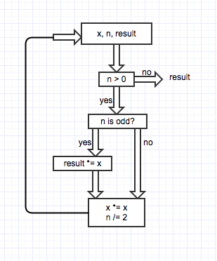

#Exponentiation By Squaring

Exponentiating by squaring is a method for fast computation of positive integer powers of a number. In comparing the [simple ](exp.rb), [recursive](exp_recursive.rb) and [while loop](exp_whileloop.rb) versions of exponentiation by squaring I received the following computation times for exp(2, 99999):

| Exponentiation Method        | Time (seconds)     |
|------------------------------|--------------------|
| Simple                       | 0.376556           |
| Recursive                    | 0.000090           |
| While loop                   | 0.000050           |

The while loop version is nearly 2 times faster than the recursive version and nearly 8000 times faster than the simple version.

###Mathematical Basis

It is based on the following equations

It is quite easy to see how these equations can be formed into a recursive algorithm. Here is the Ruby code I used

    def exp(x, n)
      return 1 if n == 0
      return x if n == 1
      if n[0].nonzero?
        x * exp(x * x, (n - 1) / 2)
      else
        exp(x * x, n / 2)
      end
    end

The edge cases are for n equals 0 or 1, in which we return 1 or x

###Algorithm Diagram

Here is a diagram visualizing how the the while loop operates to perform exponentiation by squaring.

Calcuate a^b, start with x=a, n=b, and result=1

**Variable values while calculating a^10**

| Iteration | Result     | x       | n      |
|-----------|------------|---------|--------|
| 0         | 1          | a       | 10     |
| 1         | 1          | a^2     | 5      |
| 2         | a^2        | a^4     | 2      |
| 3         | a^2        | a^8     | 1      |
| 4         | (a^2)(a^8) | a^18    | 0      |

###Time Complexity

The [simple exp](exp.rb) function is O(n) because the algorithm grows in proportion to its input

    def exp(x, n)
      result = 1
      n.times { result *= x}
      result
    end

Similarly, if there was a nested loop, the time complexity would be O(n^2).

    def mystery(x, n)
      result = 1
      n.times do 
        n.times { result *= x}
      end
      result
    end

The mystery function is x^(n^2)

**Explaining why exponentiation by squaring has O(log n) time complexity**

We can see that n (from x^n) grows exponentially compared to the number of iterations needed to solve it.

| Iterations | n     |
|------------|-------|
| 1          | 2     |
| 2          | 4     |
| 3          | 8     |
| 4          | 16    |
| 5          | 32    |

n = 2^Iterations

Iterations = log_2 (n)

Since the algorithm grows in logarithmic proportion to its input, the time complexity is O(log n)

